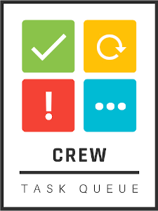
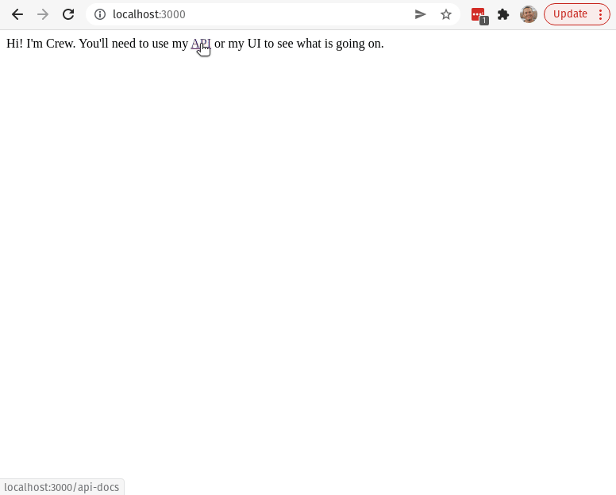
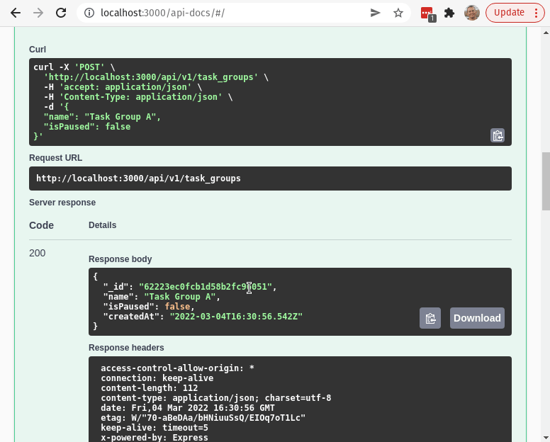
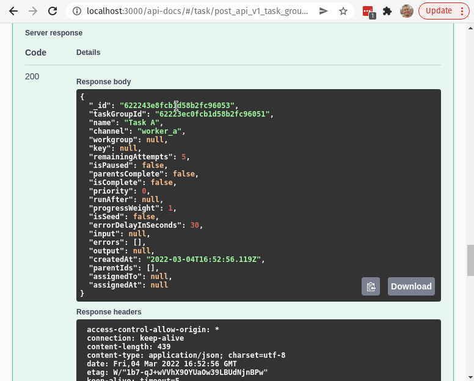
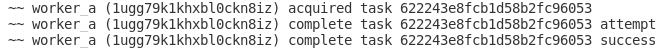

# Crew



By the team at [https://orchard-insights.com](https://orchard-insights.com)


A backend task processing tool for Node.js and beyond.

Features:
- Parent / child task structure (directed acyclic graph)
- Pause / resume groups of tasks
- Continuations (tasks can create more tasks)
- Delayed, scheduled tasks
- Can manage rate limit errors by pausing all tasks in same workgroup
- Merge duplicate tasks
- Workers can be written in any language
- Workers can poll for tasks or receive them via webhooks

**The webhooks feature of this tool is currently not ready for production use.**

## Quickstart

### CLI

1) Install the CLI:

```
npm install --global @orchard-insights/crew
```

2) Run the crew server with

```
crew start
```

3) Once crew has started you can launch demo workers with

```
crew work
```

4) Use the swagger UI to create a task group



5) Use the swagger UI to create a task



6) Use the swagger UI or console output to monitor the task



Worker logging in terminal:



### UI

The crew UI is in a different project : [https://github.com/orchard-insights/crew-ui](https://github.com/orchard-insights/crew-ui)

### Embed in Express App

```
import { crew } from '@orchard-insights/crew'

const app = express()
const server = http.createServer(app)

// Setup your express app ...

// Then mount crew

app.use('/crew', crew({
  server
}))

server.listen(port, () => {
  console.log(`Example app listening on port ${port}`)
})
```

Note that Crew can provide realtime UI updates via websockets so access to the server instance is necessary.  You can also provide an "io" option to the crew config if you already have socket.io instantiated in your server.

```
app.use('/crew', crew({
  server,
  io: new Server(server)
}))
```

## About

### API

Crew exposes an API that can be used by both the user interface and workers.

### Authentication

Use your own middleware to provide authentication.  For websocket connections, you can provide an authenticateSocket callback:

```
const express = require('express')
const { crew } = require('@orchard-insights/crew')
const http = require('http')
const basicAuth = require('express-basic-auth')

const port = 3000
const app = express()
const server = http.createServer(app)

app.use(basicAuth({
  challenge: true,
  users: { 'admin': 'supersecret' }
}))

app.get('/', (req, res) => {
  res.send('Hello World!')
})

app.use('/crew', crew({
  server
}))

server.listen(port, () => {
  console.log(`Example app listening on port ${port}`)
})
```

Workers that implement HttpWorker and are invoked via web requests can override the authMiddleware function and provide their own authentication middleware as well.

### About Tree Structure

The tasks in Crew can be composed to form a tree structure.  Each task can have zero or many parents. Tasks can also have zero or many children.  The parentIds field on Tasks is used to form these relationships.  *A task will never be assigned to a worker until all of it's parent tasks have completed successfully.*

Task Groups are used to break large tasks down into many small tasks.  Every task belongs to a tree.

### About Task Group Reset / Seed Jobs

Task Groups can be re-set which will allow them to be re-executed.  This should only be used for developing / debugging workers. 

Tasks flagged with isSeed=True, are the only tasks that are retained when a task group is reset.

This is used in task groups where an initial seed task creates lots of other child tasks.  However, In task groups where there aren't any isSeed tasks, all the tasks will be reset and none will be deleted.

### About Continuations

A continuation occurs when execution of a task results in additional tasks.  Continuation tasks are always children of the task that created them.

### About Duplication Merge

Crew can automatically complete tasks that are identical.  The primary use case for this feature is when a large volume of nightly tasks fails to complete before the next night's run.  Instead of creating an even larger bottleneck duplicate tasks can be merged instead of repeated.

The "key" field is used for duplication merge.  Whenever Crew assigns a task it will find any other tasks that have the same key in the same channel. The matching tasks will have assignedTo set to indicate that they are also in-progress.  Whenever Crew is completing a task it will again look for any other tasks that have the same key in the same channel.  The matching tasks will receive the same output or error.

### About Workers

Each worker operates within a channel such as "send_welcome_email". Workers ask for tasks by calling the "acquire" API endpoint.  Each request to this endpoint must contain a unique worker id and the channel name that the worker is requesting work from.  If a task is available it will be returned to the worker along with the output of any of the task's parents.  The returned task will be locked by the worker via the assignedTo field.

Once the task has been completed (or if an error occurs) the worker must return a result by calling the "release" API endpoint.

Workers should follow these rules:
* Workers should be designed so that they cause no harm if the same job is repeated.
* Workers should be designed so that they always complete in under 60 seconds, workers that cannot complete in this amount of time should break the work into smaller continuations.
* Workers should attempt to shutdown gracefully.
* Workers should re-try calls the release API endpoint.
* If a worker encounters an error it must pass an "error" field to the release API endpoint and provide a meaningful error message.
* When a worker completes a job it must use the release API endpoint and provide meaningful output.

### About Workgroups

Crew is designed to help manage rate limit errors via workgroups.  When a rate limit error is encountered all the tasks within a workgroup can be delayed by a specific amount of time by passing a "workgroupDelayInSeconds" parameter to the release API endpoint.  Since workgroups will often be organized around a specific API key it is recommended that you use an md5 hash of the API key instead of the key itself when creating workgroup names.

### HttpWorker vs Worker

Crew provides two execution models for workers : Polling, and Http

The default model is polling where workers must use the /acquire and /release API endpoint to request and complete tasks. When using this model you can use the built-in Worker class to implement your workers.

Crew version 1.0.12 added the ability for workers to be invoked via http calls.  This allows workers to be hosted as web apps or cloud functions.  When using this model you can use the built-in HttpWorker class to implement your workers.  Note that using HttpWorkers in production requires additional configuration of a messenger to invoke callbacks in a durable manner - see the "Messengers Config" section below.

Crew delivers tasks to http workers via POST requests (JSON) that contain the following parameters:
- input : The input for the task
- parents : Data from each of the task's parents (channel, input, and output)
- taskId : The id of the task

Http workers should in turn respond with either an http error code, or with a json object that contains a [TaskResponse](./src/TaskResponse.ts):
- output (anything)
- children (array of [TaskChild](./src/TaskChild.ts))

### About Operators

An Operator is used to specify which http endpoint to use when delivering a task to an HttpWorker.  Operators contain the following fields:
- channel: What (Task.)channel this operator represents.
- url: Where to POST tasks within the channel.  Post body params are : input, parents, and taskId
- requestConfig: Additional configuration to apply to the POST request that is sent to the worker (such as authentication headers) - see [Axios' Request Config](https://axios-http.com/docs/req_config).
- isPaused: Whether this operator is paused or not.

Note, if all of your workers use the same base URL, you can skip creating operators for every channel by setting environment variable : CREW_VIRTUAL_OPERATOR_BASE_URL

For example if you set CREW_VIRTUAL_OPERATOR_BASE_URL = http://localhost/myworkers/

Then tasks in channel send_spam will be posted to http://localhost/myworkers/send_spam

Note that you can use the CREW_VIRTUAL_OPERATOR_AUTH_TOKEN to implement basic token based authentication for HttpWorkers.  Overriding HttpWorker's authMiddleware method can also be used to provide other forms of authentication in workers.

## Development

### GitHub Codespaces Development

This project contans a devcontainer that can be used for development with [GitHub Codespaces](https://github.com/codespaces).

You can use Codespaces in the browser or via the [GitHub Codespaces VSCode Plugin](https://marketplace.visualstudio.com/items?itemName=GitHub.codespaces).

After opening a container you'll need to start a mongodb instance on [Atlas](https://www.mongodb.com/).
In order to access the cluster from codespaces you'll need to run this command in the codespace:

```
curl ifconfig.me
```

Then go to the "Network Access" tab for your cluster and put in the returned IP address.  You will need to update this IP every time you start your container!

Next you'll need to create a .env file.  You'll need to collect three pieces of information:

1) Get the MongoDB connection string for the cluster via the "Connect" button in atlas.  Use the "Connect your application" option to get a connection string.
2) Get the url for port 3000 in your codespace. Go to the Ports tab in VSCode and get the Local Address for port 3000 (remove the trailing /)

Use this info to create an .env file with the following information.

```
CREW_MONGO_URI=<TODO - connection string>
CREW_API_BASE_URL=http://localhost:3000/
```

Continue to step 4 below for command to start crew!

Note: Node processes seem to hang in codespaces.  You can use the following command to see what process id is using a port (port is 3001 in example).  Then use "kill **PID**" to force the process to stop.

```
netstat -nlp|grep 3001
```

### Local Development

To develop Crew you'll only need Node.js and MongoDB.  Follow these 6 steps to get everything up and running locally:

#### 1. MongoDB

The easiest way to run MongoDB is with Docker Desktop.

On mac/windows:
```
docker volume create orchard-crew-mongodb
docker run --rm --name orchard-crew-mongo -p 27017:27017 -v orchard-crew-mongodb:/data/db -d mongo
```

On linux:
```
docker run --rm --name orchard-crew-mongo -p 27017:27017 -v /home/aaron/Volumes/orchard-crew-mongodb:/data/db -d mongo
```

#### 2. Environment Variables

Next, create a file called .env with the following contents:

```
CREW_MONGO_URI=<TODO - connection string>
CREW_WORK_INTERVAL_IN_MILLISECONDS=15000
CREW_WORK_INTERVAL_RESTART=yes
CREW_SHUTDOWN_TIMEOUT_IN_MILLISECONDS=30000
CREW_WORKER_PORT=3002
CREW_API_BASE_URL=http://localhost:3000/
CREW_CLEAN_EXPIRED_GROUPS=yes
CREW_ABANDONED_TASK_INTERVAL_IN_SECONDS=60
CREW_EXPIRED_GROUP_INTERVAL_IN_DAYS=7
CREW_GRACEFUL_SHUTDOWN=yes
```

#### 3. Node.js

Start by running yarn install:

```
yarn install
```

The code within this project implements 3 components:
- Crew API
- Demo Wokers
- CLI

You can run each component individually by running these commands in separate terminal windows:
```
yarn dev
yarn dev:workers
yarn cli start
yarn cli work
```

When using Google Cloud Tasks with HttpWorkers you will need to expose your locally running crew api to the web with something like ngrok:
```
ngrok http 3000
```

Then set CREW_API_PUBLIC_BASE_URL env var:

```
CREW_API_PUBLIC_BASE_URL=https://08d0-172-221-82-130.ngrok.io/
```

#### 4. Run tests

```
yarn test
```

#### 5. Messenger Config

Internally, crew uses a workflow of cascading events called examine and execute to determine when to send requests to HTTP workers.  In order to support delayed tasks as well as workflow durability, crew needs an external tool to trigger examine and exeucte events.  Currently crew only provides a messenger based on Google Cloud Tasks.  You can easily implement your own messenger by implementing the [Messenger interface](./src/Messenger.ts).

The messenger to use is specified in the crew configuration options:

```
app.use('/crew', crew({
  server,
  io: new Server(server),
  messenger: new GoogleCloudTasksMessenger()
}))
```

**Google Cloud Tasks Messenger**

In order to use HttpWorkers in production you can provide access to a [Google Cloud Tasks](https://cloud.google.com/tasks) project.

Begin by enabling the Cloud Tasks API, and then setup two Queues with these names:

```
crew-execute
crew-examine
```

Then you will need to obtain a google cloud service account file that provides at least the ["createTask"](https://cloud.google.com/tasks/docs/reference-access-control) permission.

Then configure the following environment variables to point crew at your Cloud Tasks instance:

```
GOOGLE_APPLICATION_CREDENTIALS=path/to/service_account.json
CREW_QUEUE_LOCATION=todo-gc-location
CREW_QUEUE_PROJECT=your-project-name
```

Also note that when using HttpWorkers you'll also likely want to set these two env vars:

```
CREW_VIRTUAL_OPERATOR_BASE_URL
CREW_VIRTUAL_OPERATOR_AUTH_TOKEN
```

See the "About Operators" section above for more information about these two env vars.

### Environment variables

**CREW_MONGO_URI** : Mongod connection string. You can set this to "MEMORY" to use an ephemeral local instance.

**CREW_GRACEFUL_SHUTDOWN** : When set to "yes", Crew will use terminus to attempt to gracefully shutdown.

**CREW_SHUTDOWN_TIMEOUT_IN_MILLISECONDS** : How long Crew should wait for pending tasks to complete during graceful shutdown.

**CREW_ABANDONED_TASK_INTERVAL_IN_SECONDS** : How long Crew waits for a worker to release a task before it assumes something bad has happened to the worker and re-assigns the task.

**CREW_CLEAN_EXPIRED_GROUPS** : When set to "yes", Crew will delete task groups that are older than CREW_EXPIRED_GROUP_INTERVAL_IN_DAYS.

**CREW_EXPIRED_GROUP_INTERVAL_IN_DAYS** : Task groups that are older than this many days will be automatically deleted if clean expired groups is enabled.

**CREW_WORK_INTERVAL_IN_MILLISECONDS** : For demo workers. How often each worker should attempt to acquire a task.

**CREW_WORK_INTERVAL_RESTART** : For demo workers. When set to "yes", worker will immediately attempt to acquire a task after a task is released.

**CREW_WORKER_PORT** : For demo workers. JavaScript demo workers provide their own express server so they can be invoked via cron.  This tells them what port to use.

**CREW_API_BASE_URL** : For demo workers.  Tells them where the API is.  Include a trailing /, like this "http://localhost:3000/".

### Running the Python example workers

Begin by creating a virtual environment

```
python3 -m venv .venv
```

Then activate the virtual environment

```
source .venv/bin/activate
```

(activating on Windows)
```
.\.venv\Scripts\activate
```

Then install dependencies

```
pip install -r ./demo/python/requirements.txt
```

You'll need to manually export environment variables.

Finally, run the example workers

```
python ./demo/python/workers.py
```